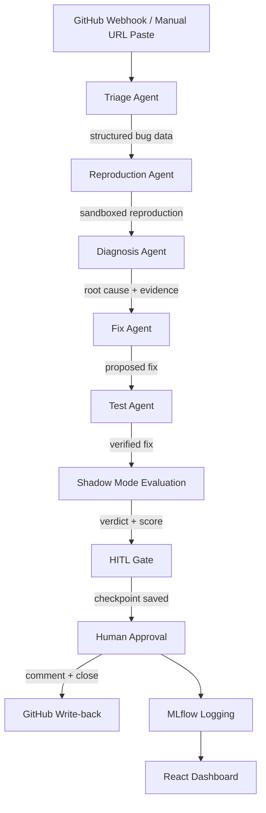

# Huginn — Shadow-Mode Agentic Software Engineer

> **Live Dashboard:** Temporarily unavailable — waiting on permanent domain approval (eu.org). Backend runs locally via Docker; a persistent public link will be added here once the domain is live.

> **Video Walkthrough:** [Watch the demo](https://drive.google.com/file/d/1d1s-WQtBi4zDcu048lkvtFwNUQxbMuTq/view?usp=sharing)

Named after Huginn, one of Odin's two ravens in Norse mythology — sent out to observe the world and report back before any decision is made.

## What this is

Huginn is a six-agent AI pipeline that reads a real GitHub issue, reproduces the bug inside an isolated Docker sandbox, diagnoses the root cause, proposes a fix, tests it, and — once a human has independently resolved the same issue — scores the AI's fix against the human's real fix. It never pushes anything to a live repository without explicit human approval.

**The core idea:** don't trust an AI agent's judgment because it sounds confident. Trust it because you've measured it, over real issues, against real human outcomes, and it's earned that trust with evidence.

This is the same pattern real engineering organizations use before giving an AI system live authority — shadow mode first, autonomy later, and only if the evidence supports it. It is deliberately the highest-effort, highest-signal project in a five-project portfolio.

## Architecture



### The six agents

| Agent | Job | Model |
|---|---|---|
| Triage | Reads the raw bug report, classifies it, extracts structured reproduction steps and the expected result | NVIDIA Nemotron 3.5 Lightning |
| Reproduction | Writes Python code to reproduce the bug, runs it inside an isolated Docker container | NVIDIA Nemotron 3 Super |
| Diagnosis | Compares expected vs. actual output, identifies the root cause with supporting evidence | NVIDIA Nemotron 3 Super |
| Fix | Proposes a complete, runnable code fix grounded on the original code, with an explanation | NVIDIA Nemotron 3 Super |
| Test | Runs the proposed fix in a fresh Docker sandbox, verifies it produces the expected result and doesn't crash | Pure execution + comparison, no LLM |
| Shadow Mode Evaluation | Compares the AI's fix against a human's real, independently-written resolution — similarity score, reasoning, and verdict | NVIDIA Nemotron 3 Super |

Each agent has a strict, typed input/output schema (Pydantic) — the contract between agents is explicit, never a loose blob of text. All six agents are wrapped as LangGraph nodes sharing one `PipelineState`, so a full run can be checkpointed to SQLite and resumed cleanly across server restarts.

## Safety: sandboxed execution

AI-generated code never runs unrestricted. Every execution inside Docker enforces:

- **No network access** — blocks the sandbox from leaking sensitive data out or pulling malicious scripts in
- **Memory limit (256MB)** — stops runaway allocations from degrading host machine performance
- **Execution timeout (30s)** — terminates infinite loops automatically, preventing background task starvation

This is treated as the single most safety-critical piece of infrastructure in the project, never a formality.

## Safety: human-in-the-loop

Before anything reaches a live repository — a comment, a PR, or an issue state change — the LangGraph pipeline pauses with a genuine `interrupt_before=["human_approval"]`, writes its complete state to a SQLite checkpoint, and halts. The server process can exit or restart entirely while paused without losing run state.

A separate, explicit human action — clicking "Approve & Close Out" in the dashboard — triggers a FastAPI endpoint that resumes the pipeline from that exact saved checkpoint. Upon approval:

- A structured evaluation summary is posted as a comment on the real GitHub issue
- If the verdict is `trustworthy`, the issue is automatically closed
- If the verdict is `needs_human_rework`, the comment is posted for developer review, but the issue remains open

## Shadow mode evaluation

When a human's real fix exists, the Shadow Mode agent produces a genuine similarity score (0.00–1.00), a short reasoning, and a verdict of `trustworthy` or `needs_human_rework`.

When no human fix exists yet for a freshly submitted issue, it returns an explicit `no_human_baseline_yet` guard-clause result instead of hallucinating a comparison — an honest baseline rather than an ungrounded guess. Developers can submit an actual human fix at any time through the dashboard to trigger on-demand re-evaluation.

## Experiment tracking & results

Every completed run is logged to MLflow — `similarity_score`, `verdict`, `fix_passed`, the AI's proposed fix, the human's real fix, reasoning, and repository metadata — tagged by unique thread IDs.

**Result after real-world testing on 20 distinct GitHub issues:**

- Total Runs: 20
- Average Similarity Score: 0.87
- Trustworthy Rate: 80% (16 of 20 runs)
- Needs Human Rework Rate: 20% (4 of 20 runs)

The evaluation suite tested across 13 distinct bug classes (sign inversions, recursion base cases, off-by-one slice bounds, in-place iteration side effects, unhashable dictionary keys, binary search boundaries, and stack imbalances). The judge demonstrated semantic discernment — flagging in-place list mutation as rework despite identical test outputs.

## GitHub integration

Two entry points feed the same pipeline:

- **Webhook** — GitHub notifies Huginn automatically the moment a new issue is opened on a connected repository, triggering background execution with zero human action needed
- **Manual URL paste** — a developer pastes any public GitHub issue URL into the dashboard to inspect the pipeline live, agent by agent

## Dashboard

A React + Tailwind interface built in an industrial Utilitarian / Swiss design system — high contrast, monospaced tabular figures, strict grid alignment, zero decorative chrome.

- **Runs** — interactive issue URL submission and historical run catalog
- **Fix Comparison** — side-by-side diff pane of AI proposed fix vs. human actual fix with live verdict badge and rationale
- **Metrics** — full telemetry trend graphs tracking similarity score and trustworthiness across all logged runs
- **Repositories** — live webhook connection status and per-repo evaluation statistics
- **Audit** — immutable operational log tracking human approvals, GitHub API write-backs, and pipeline error telemetry

## Setup

**Backend:**
```bash
cd backend/agents
pip install openai docker langgraph langgraph-checkpoint-sqlite mlflow fastapi uvicorn httpx python-dotenv pydantic
uvicorn main:app --reload --port 8000
```

**Frontend:**
```bash
cd frontend
npm install
npm run dev
```

**Prerequisites:**
- Docker Desktop running locally
- `.env` file in `backend/agents/` containing:
```
NVIDIA_API_KEY=your_nvidia_api_key
GITHUB_TOKEN=your_github_personal_access_token
GITHUB_WEBHOOK_SECRET=your_webhook_secret
```

## Stack.

Python · LangGraph · Docker SDK · SQLite (checkpoints & audit) · FastAPI · MLflow · React · Tailwind CSS · Vite · NVIDIA NIM (Nemotron models)

