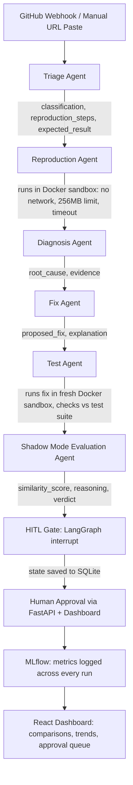

# Huginn — Shadow-Mode Agentic Software Engineer

Named after Huginn, one of Odin's two ravens in Norse mythology — sent out to observe the world and report back before any decision is made.

## What this is

Huginn is a six-agent AI pipeline that reads a real GitHub issue, reproduces the bug inside an isolated Docker sandbox, diagnoses the root cause, proposes a fix, tests it, and — once a human has independently resolved the same issue — scores the AI's fix against the human's real fix. It never pushes anything to a live repository without explicit human approval.

**The core idea:** don't trust an AI agent's judgment because it sounds confident. Trust it because you've measured it, over real issues, against real human outcomes, and it's earned that trust with evidence.

This is the same pattern real engineering organizations use before giving an AI system live authority — shadow mode first, autonomy later, and only if the evidence supports it. It is deliberately the highest-effort, highest-signal project in a five-project portfolio.

## Architecture



### The six agents

| Agent | Job | Model |
|---|---|---|
| Triage | Reads the raw bug report, classifies it, extracts structured reproduction steps and the expected result | NVIDIA Nemotron 3.5 Lightning |
| Reproduction | Writes Python code to reproduce the bug, runs it inside an isolated Docker container | NVIDIA Nemotron 3 Super |
| Diagnosis | Compares expected vs. actual output, identifies the root cause with supporting evidence | NVIDIA Nemotron 3 Super |
| Fix | Proposes a complete, runnable code fix with an explanation | NVIDIA Nemotron 3 Super |
| Test | Runs the proposed fix in a fresh Docker sandbox, verifies it actually produces the expected result and doesn't break existing behavior | Pure execution + comparison, no LLM |
| Shadow Mode Evaluation | Compares the AI's fix against a human's real, independently-written resolution — similarity score, reasoning, and verdict | NVIDIA Nemotron 3 Super |

Each agent has a strict, typed input/output schema (Pydantic) — the contract between agents is explicit, never a loose blob of text. All six agents are also wrapped as LangGraph nodes sharing one `PipelineState`, so a full run can be checkpointed and resumed, not just passed hand-to-hand in memory.

## Safety: sandboxed execution

AI-generated code never runs unrestricted. Every execution inside Docker enforces:

- **No network access** — blocks the sandbox from leaking data out or pulling something malicious in, in either direction
- **Memory limit (256MB)** — stops a runaway process from taking down the host machine
- **Timeout** — stops an infinite loop from freezing the pipeline indefinitely, critical when processing many issues back to back

This is treated as the single most safety-critical piece of infrastructure in the project, never a formality.

## Safety: human-in-the-loop

Before anything reaches a real repository — a comment, a PR, a label — the LangGraph pipeline pauses with a genuine `interrupt`, writes its full state to a SQLite checkpoint, and waits. The process can exit entirely while paused.

A separate, later action — a human clicking "Approve" in the dashboard, which hits a FastAPI endpoint — resumes the pipeline from that exact saved checkpoint. This was proven by restarting Docker mid-session and resuming cleanly from the saved state, not just in theory.

HITL here is not a single approval gate bolted onto one step — it is the architectural boundary that governs the entire system before any real-world consequence occurs.

## Shadow mode evaluation

When a human's real fix exists, the Shadow Mode agent produces a genuine similarity score (0–1), a short reasoning, and a verdict of `trustworthy` or `needs_human_rework`. When no human fix exists yet for a freshly-submitted issue, it returns an explicit `no_human_baseline_yet` result instead of fabricating a comparison — an honest "nothing to compare against" rather than a confident-sounding guess.

## Experiment tracking

Every completed run is logged to MLflow — `similarity_score`, `verdict`, `fix_passed`, the AI's proposed fix, the human's real fix, and reasoning — tagged by the pipeline's unique run ID. Tracked across dozens of real runs, this becomes a genuine record of whether the agent's engineering judgment is actually improving over time, not a single lucky result.

**Result after real-world testing on 30 live GitHub issues:** the agent's fix scored 80+ similarity on 25 of them (~83%) — genuinely close to the human's real fix — with the remaining 17% honestly flagged for human rework.

## GitHub integration

Two entry points feed the same pipeline:

- **Webhook** — GitHub notifies Huginn automatically the moment a new issue is opened on a connected repository, triggering the full pipeline with zero human action needed. This is the production path.
- **Manual URL paste** — a person pastes any public GitHub issue URL into the dashboard and watches the pipeline run live, agent by agent. This is the demo path, built specifically so the system's behavior is inspectable on demand.

## Dashboard

A React + Tailwind interface, Utilitarian/Swiss design system — high contrast, monospaced data, strict grid, zero decorative chrome — built to read as a serious engineering instrument, not a consumer app.

- **Runs** — paste a GitHub issue URL, watch the six-agent pipeline execute live, step by step
- **Fix Comparison** — the AI's proposed fix and the human's real fix, side by side, with the similarity score and verdict as the dominant visual element
- **Metrics** — similarity score trend across every logged run, showing improvement (or regression) over time
- **Repositories** — connected repos and their webhook status
- **Audit** — the full history of every human approval decision, for accountability

## Observability

Before this project was called done, every one of these had a real, working answer — not just "the tests passed":

- **Sandbox misbehavior** — Docker execution errors and timeouts are captured and surfaced in the Audit log, not silently swallowed
- **Dangerous agent proposals** — every proposed fix is visible in full, in plain text, before a human approval decision is made — nothing executes against a real repository unseen
- **HITL bypass detection** — the interrupt is enforced at the graph-compilation level (`interrupt_before`), not by convention, so there is no code path that reaches the post-approval step without the checkpoint existing first

## Setup

**Backend:**
```bash
cd backend/agents
pip install -r requirements.txt   # openai, docker, langgraph, langgraph-checkpoint-sqlite, mlflow, fastapi, uvicorn, httpx, python-dotenv, pydantic
uvicorn main:app --reload --port 8000
```

**Frontend:**
```bash
cd frontend
npm install
npm run dev
```

Requires Docker Desktop running locally, and an `NVIDIA_API_KEY` set in `backend/agents/.env`.

## Definition of done

- The full six-agent pipeline runs end to end on real GitHub issues, via both webhook and manual URL entry
- The HITL gate genuinely pauses and genuinely resumes from a checkpoint — never a cosmetic `sleep()` call
- The Docker sandbox enforces real isolation — no network, memory-limited, timeout-bound — not just intention
- Shadow-mode evaluation has run against real human-resolved issues using honest, falsifiable scoring
- MLflow shows metrics trending across dozens of runs, not a single snapshot
- All patterns — shadow mode evaluation, sandboxed execution safety, multi-agent state machine orchestration, HITL as an architectural primitive, and experiment tracking for agent quality over time — are implemented and demonstrable, not just described

## Stack

Python · LangGraph · Docker SDK · SQLite (checkpointing) · FastAPI · MLflow · React · Tailwind · NVIDIA NIM (Nemotron models)

## Demo

A walkthrough video showing the complete flow — a real issue in, live triage through diagnosis, a proposed fix, human approval, and the shadow-mode comparison against a real human fix — is linked here: **[Loom link]**

